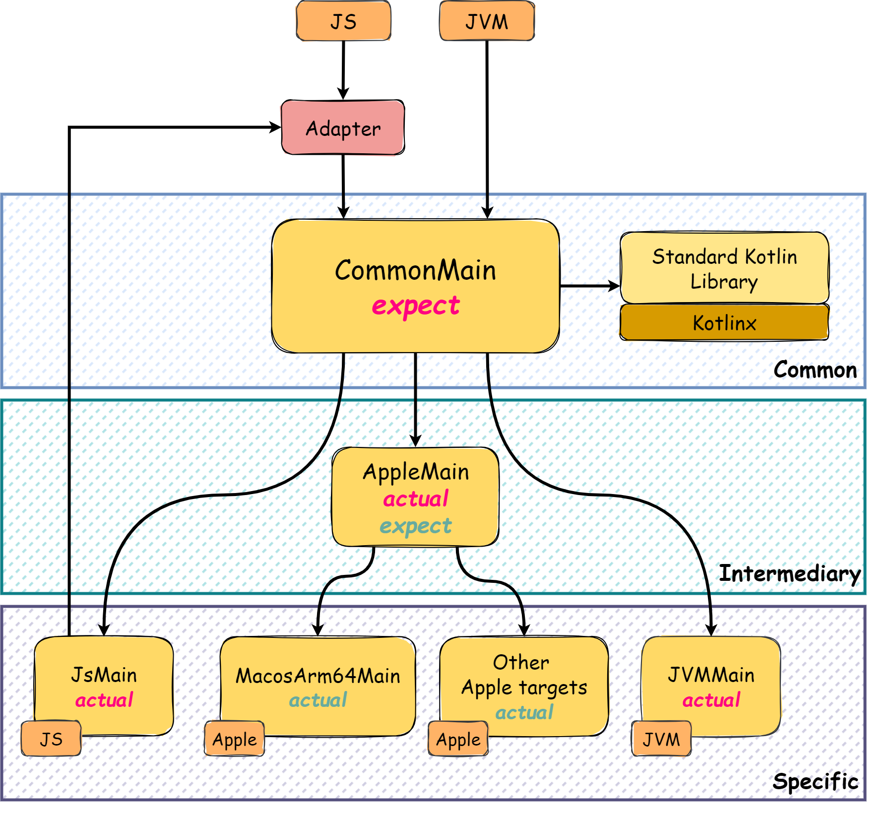

# Proposta de Projeto

## Tabela de conteúdos

1. [Contexto](#contexto)
    - 1.1. [Tolerância a falhas e mecanismos de resiliência](#tolerância-a-falhas-e-mecanismos-de-resiliência)
    - 1.2. [Bibliotecas de Resiliência](#bibliotecas-de-resiliência)
    - 1.3. [KMP](#kmp)
2. [Problema](#problema)
3. [Solução](#solução)
    - 3.1. [Ktor](#ktor)
4. [Demonstração](#demonstração)
5. [Potenciais Riscos e Desafios](#potenciais-riscos-e-desafios)
6. [Notas Adicionais](#notas-adicionais)

## Contexto

### Tolerância a falhas e mecanismos de resiliência

- É a capacidade de um sistema distribuído de continuar a funcionar, mesmo que um ou mais dos seus
  componentes/serviços falhem;
- De forma a responder a esta necessidade, estes sistemas adotam mecanismos de resiliência. Seguem-se alguns exemplos:
    - **Retry**: Consiste em tentar novamente uma operação que falhou, aumentando a probabilidade de sucesso;
    - **Rate Limiter**: Consiste em limitar a taxa de requisições que um serviço pode receber;
    - **Circuit Breaker**: Consiste em interromper, temporariamente, a comunicação com um serviço que está a falhar, de
      forma a evitar que o mesmo sobrecarregue o sistema;
    - **Fallback**: Consiste em fornecer um valor ou executar uma ação alternativa, caso uma operação falhe.

### Bibliotecas de Resiliência

- Fornecem mecanismos para lidar com as eventuais falhas em sistemas distribuídos e garantir a
  disponibilidade e confiabilidade dos serviços que disponibilizam;
- Exemplos de bibliotecas de resiliência no mercado:

  | Biblioteca                                              | Linguagem   | Plataforma |
    |---------------------------------------------------------|-------------|------------|
  | Netflix's [Hystrix](https://github.com/Netflix/Hystrix) | Java        | JVM        |
  | [Resilience4j](https://resilience4j.readme.io/docs)     | Java/Kotlin | JVM        |
  | [Polly](https://github.com/App-vNext/Polly)             | C#          | .NET       |

### KMP

- Ao contrário de código em Kotlin que compila para a JVM, ficando o mesmo intrinsecamente comprometido com esta
  plataforma, o
  KMP (Kotlin Multiplatform) permite que o código base e lógico da aplicação, independente da plataforma, seja
  compartilhado entre as mesmas;
- Para cada plataforma alvo, regularmente denominado como _target_, é necessário fornecer implementações específicas
  para as mesmas; Exemplos de targets:
    - JVM;
    - Android;
    - iOS;
    - Linux
- Portanto, o objetivo principal da utilização do KMP é maximizar a reutilização de código, delegando as eventuais
  implementações, que são específicas de cada plataforma, para o código nativo da mesma.

|  |
|:-----------------------------------------------------:|
|                  Arquitetura do KMP                   |

## Problema

- Não existem bibliotecas de resiliência em Kotlin que sejam multiplataforma, comprometendo o desenvolvimento de
  certas aplicações KMP.
- A biblioteca _Resilience4j_ já providencia
  um [módulo](https://github.com/resilience4j/resilience4j/tree/master/resilience4j-kotlin) para Kotlin, porém, este é
  específico para a JVM.

## Solução

- Construir uma biblioteca que forneça os mencionados mecanismos de resiliência e tolerância a falhas, para o maior
  número
  de plataformas possível, utilizando para esse efeito o KMP.
- Realizar extensões para a framework Ktor, de modo a facilitar a integração da biblioteca com a mesma.

### Ktor

- É uma framework para KMP desenhada para ajudar na criação de aplicações assíncronas de
  servidor e cliente, que se tornou popular devido à sua simplicidade e facilidade de utilização.
- Utiliza a linguagem Kotlin e o sistema de Coroutines, permitindo este último, de forma simplificada, a execução
  assíncrona de código de forma sequencial e sem bloqueio de threads.

## Demonstração

- A biblioteca será demonstrada através de um exemplo de utilização, onde será possível observar a sua integração com a
  framework Ktor.
- Para a demonstração será realizada uma aplicação que, segundo o teorema CAP, será um destes sistemas:
    - Sistemas CP (Consistente e tolerante a partição): Estes sistemas priorizam a consistência dos dados e a tolerância
      a falhas de rede, mas podem ter menor disponibilidade em situações de partição.
      Exemplos: Bancos de dados tradicionais, sistemas de controlo de tráfego aéreo.
    - Sistemas AP (Disponíveis e tolerantes a partição): Sendo sistemas que priorizam a
      disponibilidade e a tolerância a falhas de rede, mas podem comprometer a consistência temporária dos dados.
      Exemplos: Sistemas de cache, redes sociais.

## Potenciais Riscos e Desafios

### Desafios

- Primeiro projeto em KMP do arguente.
- Conseguir arranjar e/ou desenhar mecanismos de abstração de código produzido permitindo a sua reutilização.
- Testar a biblioteca em diferentes plataformas.
- Integrar a biblioteca com a framework Ktor.
- Realizar e projetar uma aplicação de demonstração que seja capaz de evidenciar a utilidade da biblioteca, visto que
  não são todas as aplicações que necessitam de mecanismos de resiliência.

### Riscos

- Incapacidade de implementar e testar os mecanismos de resiliência a que nos propomos a implementar, seja por falta de
  conhecimento ou por falta de tempo.

## Notas Adicionais

- O target iOS será, provavelmente excluído, excluído da demonstração, visto que o arguente não possui um dispositivo
  iOS ou outro meio de
  testar a aplicação nessa plataforma.
